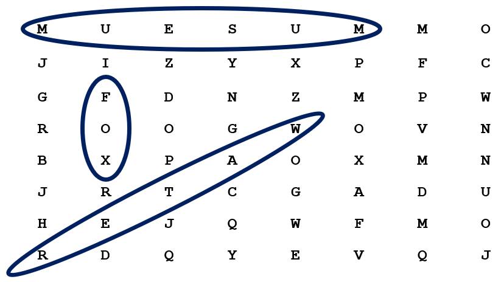
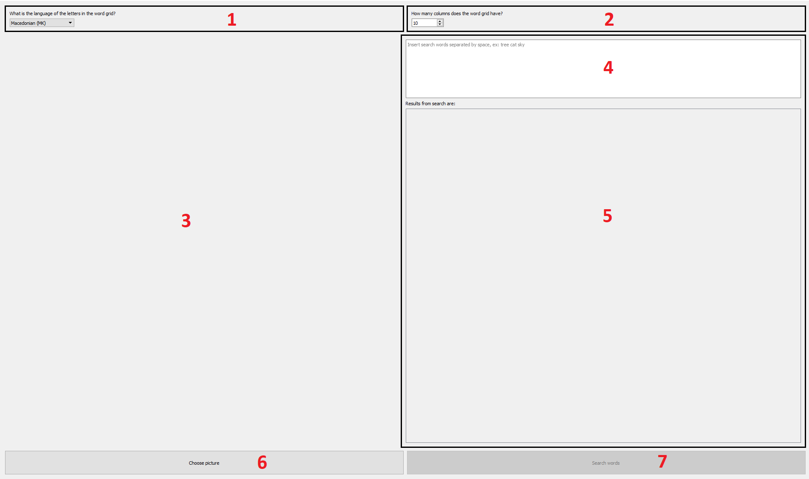
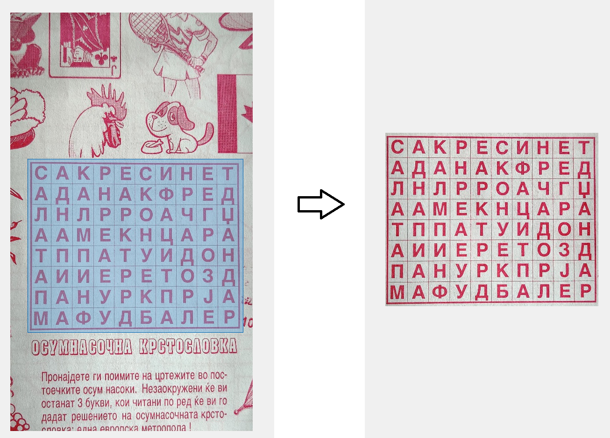

# Crossword Solver

Crossword Solver is a program that locates solutions for 8-way crosswords.
The 8-way crosswords are different from the typical crosswords we might think of.
Instead of filling in words, in this crossword letters are already filled out in a grid.
We are given a set of pictures, and we try to find the words that represent the picture.
The words can be in 8 different orientations in the word grid:
- from left to right
- from top-left to bottom-right
- from top to bottom
- from top-right to bottom left, and so on

## How it works
The crossword solver is a tool in which you can input a picture of an 8-way crossword. When
you give it some words to search, it will find where those words are located in the word grid.

Firstly you upload an image to the solver. The crossword solver processes the image: converts to grayscale, resizes, blurs,
thresholds and applies morphological operators (erosion,dilation...). This processed image is saved which is going to be used for optical character recognition (OCR).
Another image is saved without any processing done to it, except resizing. This second image is only used for displaying on the user interface of the program.
After the user inputs words in the text field and clicks on the "Search Words" buttons, an OCR is called. The OCR 
produces a text document contained all the letters it has found in the uploaded image. This text file is processed
in order to remove any digits, whitespaces, etc. The processed text is saved as a new text file. The solver then 
searches for all the possible solutions in this text file, and produces an output that is displayed on the user interface.
This output contains all the letters from the processed text file, but it also includes parentheses around the letters
that are part of each search word.

### Work area
The picture shows the working area of the program. The numbered sections are:
1. Language selection for the OCR
2. Input field for number of column in the word grid
3. Display area of uploaded image
4. Input area of words to be searched in the word grid
5. Results from the search
6. Button to upload an image
7. Button to search for the given input words in the image

### Few notes
- The quality of the results depends upon the quality of the performed OCR. It should be noted that it is possible for the solver
to not be able to find all the results
  
- The value in the column number selector should be experimented with (+/-) in case the solver isn't able to find any solutions.
  The ratio defined in the imagePreprocessing.py script is a good default, but sometimes selecting a higher number of 
  columns than there actually are, gave more solutions.
  

## Cropping feature
The crossword solver also includes an image cropping feature. After you have uploaded an image, you can click-hold-and-drag to select
and area which you want to crop from the uploaded image. By doing so you can improve the chances of finding solutions to the crossword if your uploaded
image contains some other artefacts on it (irrelevant text/irrelevant pictures).

